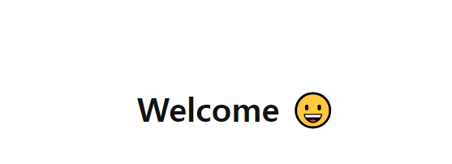

# 네이버 로그인 페이지 구현


---

로그인과 비밀번호를 정확히 입력했을 때 welcome 페이지로 넘어갈 수 있도록 코드 로직을 작성합니다.


---
- [x] 재사용 가능한 함수를 분리하고 함수를 중심으로 설계하는 방법에 대해 학습합니다.

### 과제 요구사항
```
1. email 정규 표현식을 사용한 조건처리
// - false면 해당 input에 is--invalid 추가
    node.classList.add('is--invalid')
// - true면 해당 input에 is--invalid 제거
    node.classList.remove('is--invalid')
```

```
2. pw 정규 표현식 사용한 validation
// - false면 해당 input에 is--invalid 추가
    node.classList.add('is--invalid')
// - true면 해당 input에 is--invalid 제거
    node.classList.remove('is--invalid')
```

```
3. 로그인 버튼을 클릭시 user.id의 값과 input의 값을 비교
value === user.id
```

```
4. 로그인 버튼을 클릭시 user.pw의 값과 input의 값을 비교
// value === user.pw
```

```
5. 두 값이 일치한다면 다음 페이지(welcome.html)로 이동
window.location.href='welcome.html'
```

```
// 아이디 이메일 유효성 검사
email.addEventListener('input',function() {
  if (emailReg(this.value)){
    this.classList.remove('is--invalid');
    emailPass = true;
  }else {
    this.classList.add('is--invalid');

    emailPass = false;

  }
})
```

```
// 비밀번호 유효성 검사
pw.addEventListener('input',function() {
  if (pwReg(this.value)){
    this.classList.remove('is--invalid');
    pwPass = true;
  }else {
    this.classList.add('is--invalid');

    pwPass = false;

  }

})
```
```

// 로그인 버튼을 클릭시 조건처리
button.addEventListener('click',(e)=>{
  e.preventDefault();
  
  if( email.value === user.id && pw.value === user.pw) {
    window.location.href = 'welcome.html';
  }else {
    alert('아이디 또는 패스워드를 확인 해주세요.');
  }
  
})
```

### Login 성공 시 이동



