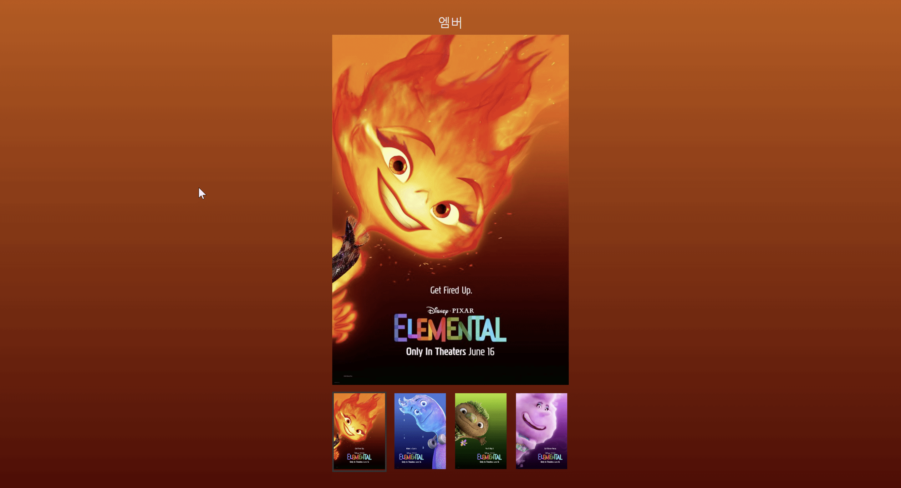

# Poster 구현


---



---

### 과제 요구사항
```
    함수 분리
    setBgColor 함수
    setImage 함수
    setNameText 함수
```

```js
함수 분리
    setBgColor 함수
    setImage 함수
    setNameText 함수

// BgColor 설정 함수
function setBgColor(colors, node) {
  const [color1, color2 = "#000"] = colors;
  node.style.background = `linear-gradient(to bottom, ${color1}, ${color2})`;
}

// Image src, alt 설정 함수
function setImage(node, name = "", alt = "") {
  node.src = `./assets/${name.toLowerCase()}.jpeg`;
  node.alt = alt;
}

// Text 설정 함수
function setText(node, text) {
  node.textContent = text;
}
```

